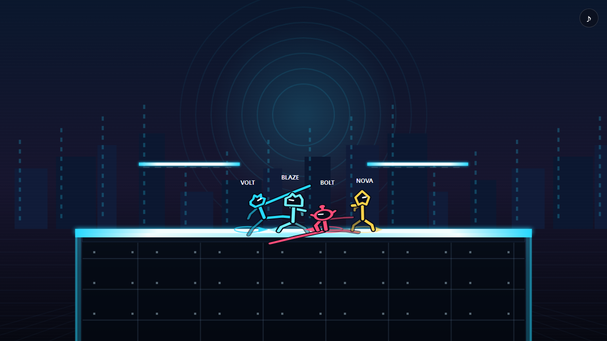
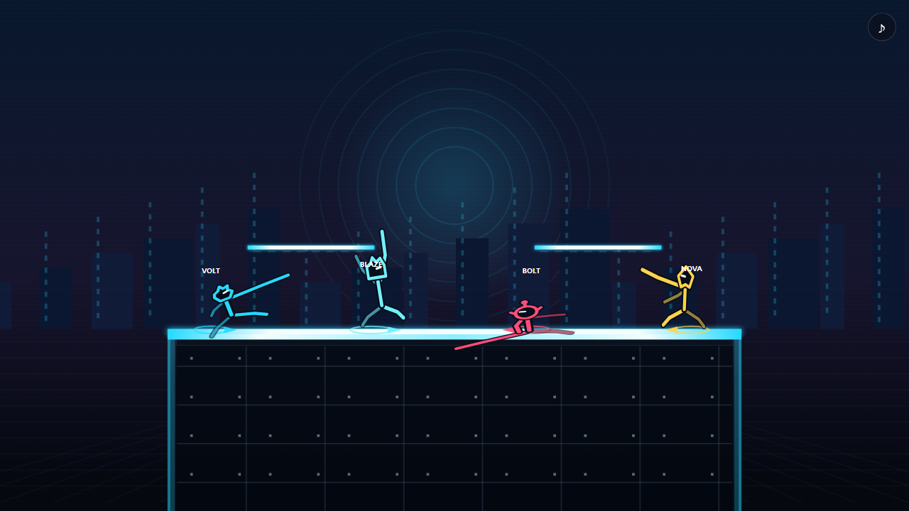

# NEON RUMBLE

> 브라우저만 열면 최대 4명이 함께 즐길 수 있는 온라인 플랫폼 난투 게임



NEON RUMBLE은 상대의 체력을 0으로 만드는 격투 게임이 아닙니다.

공격을 맞힐수록 상대의 **누적 피해율(%)**이 올라가고, 피해율이 높은 상대를 강한 공격으로 화면 밖까지 날려 보내면 승리합니다.

닌텐도나 Super Smash Bros. 시리즈와 제휴한 게임이 아닌, 독자적인 네온 캐릭터와 규칙으로 제작한 브라우저 게임입니다.

현재 버전: **v1.1.0-beta.13**

## 한눈에 보기

- 한 방보다 **위치 선정, 회피, 복귀, 연계 공격**이 중요한 플랫폼 난투
- 한 방에서 **2~4명이 온라인 대전**
- 혼자서 바로 시작하는 **BOT 대전·연습 모드**
- 친구와 방을 만들거나 **빠른 매칭**으로 대전
- 서로 다른 움직임과 기술을 가진 **캐릭터 4종**
- 구조와 기믹이 다른 **스테이지 3종**
- 목숨전, 시간전, 2대2 팀전
- 서버가 경기를 판정하므로 방을 만든 사람의 브라우저가 경기를 계산하지 않음
- 연결이 잠시 끊겨도 30초 안에 돌아오면 경기 복귀 가능

## 어떤 게임인가요?

1. 상대를 공격하면 화면 아래의 피해율이 올라갑니다.
2. 피해율이 높을수록 같은 공격에도 더 멀리 날아갑니다.
3. 점프, 공중 회피, 위 필살기 등을 사용해 스테이지로 돌아와야 합니다.
4. 목숨을 모두 잃거나 제한 시간이 끝났을 때 점수가 낮으면 패배합니다.

즉, 단순히 많이 때리는 것만큼 **언제 강한 공격을 쓸지**, **날아간 뒤 어떻게 살아 돌아올지**가 중요합니다.

## 바로 실행하기

### 가장 간단한 방법: Node.js

필요한 것:

- [Node.js 22.13 이상](https://nodejs.org/)
- Chrome, Edge 등 최신 웹 브라우저

처음 받았다면 GitHub의 **Code → Download ZIP**으로 게임을 내려받아 압축을 풉니다. 압축을 푼 폴더의 빈 곳에서 `Shift + 마우스 오른쪽 버튼`을 누르고 **터미널에서 열기**를 선택하세요.

열린 터미널에 아래 두 줄을 차례로 입력합니다.

```bash
npm install
npm start
```

서버가 켜지면 브라우저에서 [http://localhost:4173](http://localhost:4173)을 엽니다.

같은 공유기에 연결된 다른 PC에서도 플레이하려면 서버를 실행한 PC의 IP를 사용합니다.

```text
http://서버-PC-IP:4173
```

> `EADDRINUSE`가 나오면 4173 포트에서 이미 서버가 실행 중이라는 뜻입니다. 먼저 브라우저에서 위 주소를 열어 보세요. 다른 포트를 사용하려면 PowerShell에서 아래처럼 실행할 수 있습니다.

```powershell
$env:PORT = "4180"
npm start
```

### Docker로 실행하기

Docker Desktop이 설치되어 있다면 다음 명령 하나로 빌드와 실행을 함께 할 수 있습니다.

```bash
docker compose up -d --build
```

이후 [http://localhost:4173](http://localhost:4173)을 엽니다. 게임 기록은 프로젝트의 `data` 폴더에 보관됩니다.

서버 상태 확인:

```bash
docker compose ps
docker compose logs -f
```

## 첫 게임 시작하기

메인 화면에서 닉네임을 입력하고 원하는 방식을 선택합니다.

| 메뉴 | 이런 때 선택하세요 |
| --- | --- |
| **혼자 연습** | 조작법과 캐릭터 기술을 천천히 익히고 싶을 때 |
| **BOT 대전** | 기다리지 않고 AI와 실제 규칙으로 싸우고 싶을 때 |
| **BOT vs BOT 데모** | 캐릭터들이 싸우는 모습을 구경하고 싶을 때 |
| **새 방 만들기** | 친구를 초대하고 규칙·맵을 직접 정하고 싶을 때 |
| **빠른 매칭** | 공개 대전 상대를 자동으로 찾고 싶을 때 |
| **방 목록 / 방 코드 참가** | 이미 만들어진 친구 방에 들어가고 싶을 때 |

친구 방에서는 대기실에 들어온 뒤 캐릭터를 선택하고 **준비**를 눌러야 합니다. 모든 플레이어가 준비하면 방장이 경기를 시작할 수 있습니다.

처음 실행한 브라우저에서는 기본 이동, 공격, 방어, 잡기, 복귀를 배우는 튜토리얼이 자동으로 시작됩니다.

## 기본 조작

처음에는 아래 여섯 가지만 기억하면 됩니다.

| 키 | 기능 |
| --- | --- |
| `←` `→` | 이동. 계속 누르면 달리기, 빠르게 두 번 누르면 대시 |
| `↑` | 점프. 공중에서 한 번 더 누르면 2단 점프 |
| `Z` | 빠른 일반 공격 |
| `X` | 캐릭터 고유 필살기 |
| `C` | 지상에서 실드, 공중에서 회피 |
| `V` | 지상에서 잡기, 공중에서 회피 |

방향키와 공격키를 함께 누르면 공격 방향이 달라집니다.

| 입력 | 기능 |
| --- | --- |
| `방향 + Z` | 옆·위·아래 공격 또는 방향별 공중 공격 |
| `Z` 길게 누르기 | 강하게 날리는 스매시 공격 차지 |
| `방향 + X` | 옆·위·아래 필살기 |
| `↓` | 앉기 / 공중에서 빠른 낙하 / 반투명 발판 통과 |
| `방향 + C` | 지상 구르기 또는 공중 방향 회피 |
| `↓ + C` | 제자리 회피 |
| 잡은 뒤 `방향` | 앞·뒤·위·아래 던지기 |
| 잡은 뒤 `Z` 또는 `V` | 잡기 공격 |
| 게이지 100%에서 `Z + X` | 지상에서 궁극기 발동 |

보조키로 `W=↑`, `A=←`, `S=↓`, `D=→`, `F=Z`, `G=X`, `Shift=C`, `E=V`도 사용할 수 있습니다.

<details>
<summary><strong>조금 더 익숙해진 뒤 사용할 고급 조작</strong></summary>

- `Ctrl + ←/→`: 달리기로 바뀌지 않는 정밀 걷기
- 점프 버튼을 짧게 입력: 낮은 점프
- 점프와 `Z`를 동시에 입력: 낮은 점프 공중 공격
- 실드를 잠깐 유지한 뒤 공격 직전에 `C` 해제: 패링
- 날아가 바닥·벽에 닿기 직전 `C`: 낙법
- 절벽에서 방향, 점프, 공격, 실드 입력: 오르기·점프·공격·구르기 선택
- 공중에서 `↑ + X`: 주 복귀기. 착지하거나 절벽을 잡으면 다시 사용 가능

연습 모드의 **조작·기술 설명**에서 캐릭터별 기술과 모든 고급 조작을 게임 안에서 확인할 수 있습니다.

</details>

## 캐릭터



| 캐릭터 | 플레이 스타일 | 대표 기술 |
| --- | --- | --- |
| **VOLT** | 빠르게 파고드는 러시다운 | 전기 투사체, 돌진, 번개 상승 복귀 |
| **BLAZE** | 느리지만 강한 중량급 파이터 | 예측형 차지 포격, 중량 돌진, 로켓 어퍼, 카운터 |
| **BOLT** | 기동성과 거리 조절 | 부메랑, 구르기 공격, 스프링 복귀, 지면 충격파 |
| **NOVA** | 공중 기동과 순간이동 | 별 투사체, 차지 순간이동 베기, 워프 복귀, 중력장 |

모든 캐릭터는 빠른 잽, 방향별 지상 공격, 다섯 방향의 공중 공격, 네 방향의 필살기와 고유 궁극기를 가집니다. 같은 캐릭터를 여러 명이 선택할 수도 있으며, 색상으로 서로를 구분합니다.

BLAZE의 중립 `X` 포격은 일반 발사 피해 `11.5%`, 완전 충전 피해 최대 `16.1%`입니다. 화면을 넓게 덮는 반복 견제보다는 상대의 착지나 긴 후딜을 예측해 맞히는 기술이며, 한 번에 하나만 유지되고 발사 후 약 1.3초의 재사용 대기시간이 적용됩니다.

## 스테이지와 게임 규칙

### 스테이지

- **Neon Deck**: 막힌 지면과 좌우 반투명 발판이 있는 기본 경기장
- **Sky Rail**: 움직이는 발판과 선택 가능한 바람 기믹
- **Reactor Core**: 나뉜 지형과 선택 가능한 에너지 펄스

### 게임 모드

- **목숨전**: 정해진 목숨을 모두 잃으면 탈락
- **시간전**: 제한 시간 동안 KO는 +1점, 자멸은 -1점
- **2대2 팀전**: 같은 팀과 협력하는 전투. 기본 설정에서는 아군 공격이 꺼져 있음
- **연습 모드**: 위치·피해율 초기화, 프레임 정지, 판정 표시, CPU 난이도 변경 지원

공개 매칭의 기본 규칙은 **3목숨, 7분, 아이템과 스테이지 위험요소 없음**입니다. 친구 방에서는 방장이 규칙을 바꿀 수 있습니다.

## 온라인 플레이 특징

- 서버에서 60회/초로 전투를 계산하고, 브라우저에는 30회/초로 상태를 전달
- 화면은 받은 상태 사이를 보간해 60FPS로 렌더링
- 핑과 연결 품질을 게임 화면에서 확인 가능
- 입력 순서 검증과 비정상 입력 제한
- 방장이 나가도 다른 플레이어에게 설정 권한 자동 승계
- 연결 종료 후 30초 동안 자리를 보존해 새로고침·재접속 지원
- 익명 전적에는 경기, 승리, KO, 낙사, 캐릭터 사용량만 기록

## 개발·테스트

아래 내용은 게임을 수정하거나 서버를 운영하려는 사람을 위한 정보입니다.

```bash
npm test
npm run test:e2e
npm run test:e2e:soak
npm run audit:ai
```

- `npm test`: 전투 판정, 이동, 방어, 잡기, 복귀, AI, 모드 점수 등 자동 검사
- `npm run test:e2e`: 실제 Chromium에서 UI와 4인 접속·재접속 검사
- `npm run test:e2e:soak`: 지연·패킷 손실과 여러 방의 장시간 플레이 검사
- `npm run audit:ai`: 세 스테이지에서 CPU 대전을 반복해 캐릭터별 결과와 기술 사용 통계 출력

처음 브라우저 테스트를 실행한다면 Chromium을 한 번 설치해야 합니다.

```bash
npx playwright install chromium
```

### 환경 변수

| 변수 | 기본값 | 설명 |
| --- | --- | --- |
| `PORT` | `4173` | 웹 서버와 Socket.IO 포트 |
| `NEON_DB_PATH` | 운영체제별 기본 경로 | SQLite 데이터베이스 위치 |
| `NEON_SECRET` | 자동 생성·보존 | 익명 사용자와 재접속 토큰 서명 키 |
| `NEON_RECONNECT_MS` | `30000` | 연결 종료 후 자리 보존 시간 |
| `NEON_QUEUE_WAIT_MS` | `20000` | 공개 매칭이 2명 이상으로 시작하기까지 기다리는 시간 |

운영 중에는 다음 주소로 상태와 버전을 확인할 수 있습니다.

- `GET /healthz`: 버전, 가동 시간, 방·플레이어 수, 서버 틱 상태
- `GET /releases.json`: 현재 버전과 게임 내 패치 노트

## 참고

NEON RUMBLE은 현재 베타 버전입니다. 자동 테스트와 네트워크 부하 검증을 통과한 상태지만, 실제 환경에 따라 밸런스나 연결 감각이 달라질 수 있습니다. 문제를 발견했다면 재현 방법, 사용한 캐릭터, 스테이지, 입력 순서를 함께 남겨 주세요.
